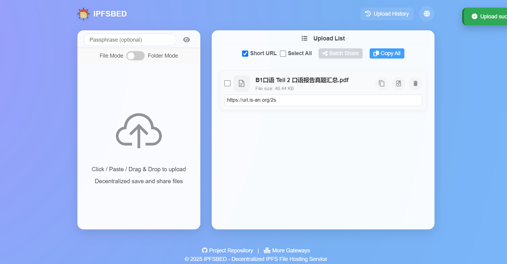

# IPFSBED - Decentralized IPFS File Hosting Service

[English](README.md) | [中文](README.zh-CN.md)

[](https://ipfsbed.is-an.org/)
[](LICENSE)
[](https://ipfs.io/)

## Overview

IPFSBED is a decentralized file hosting platform built on the InterPlanetary File System (IPFS). It allows users to upload and share files of various formats through the distributed IPFS network, making content accessible globally without relying on central servers.



## Key Features

- **Decentralized Storage**: Files are stored on the IPFS network rather than centralized servers
- **Multiple Upload Methods**: Drag & drop, clipboard paste, or traditional file selection
- **Wide Format Support**: Images, documents, videos, archives, and many other file types
- **Password Protection**: Optional encryption for sensitive files with password protection
- **Batch Sharing**: Share multiple files at once with a single link
- **Multiple Gateways**: Choose from various IPFS gateways for optimal access speed
- **Internationalization**: UI available in 12 languages
- **No Registration**: Use immediately without creating an account

## How to Use

### Single File Upload

1. Open [IPFSBED](https://ipfsbed.is-an.org/)
2. (Optional) Enter a passphrase in the password field if you want to protect your file
3. Upload a file by:
   - Clicking the upload area and selecting a file
   - Dragging and dropping a file
   - Pasting an image from clipboard (Ctrl+V)
4. After uploading, you'll get a share link
   - With passphrase: `share.html?share=encrypted_data` (recipient needs the passphrase)
   - Without passphrase: `share.html?cid=...&filename=...` (publicly accessible)

### Batch Sharing

1. Upload multiple files
2. Select the files you want to share using the checkboxes
3. Click "Batch Share"
4. (Optional) Set a passphrase for this batch of files
5. Click "Confirm & Copy Link"
6. Share the generated link with recipients
   - With passphrase: `batch-share.html?share=encrypted_data`
   - Without passphrase: `batch-share.html?files=data`

### Accessing Shared Files

1. Open the shared link
2. If password-protected, enter the passphrase when prompted
3. For batch shares:
   - You can select which files to download
   - Download individual files or all files as a ZIP archive
   - Copy links to individual files

## Advanced Features

### Multiple Gateway Support

IPFSBED offers various IPFS gateways for accessing your files. Different gateways may provide better performance depending on your location and network conditions.

### Language Support

The interface is available in multiple languages:
- English
- Chinese (简体中文)
- German (Deutsch)
- Russian (Русский)
- French (Français)
- Spanish (Español)
- Arabic (العربية)
- Persian (فارسی)
- Turkish (Türkçe)
- Portuguese (Português)
- Korean (조선어)
- Japanese (日本語)

Change language using the globe icon in the top-right corner.

## Self-Hosting

You can customize the IPFS upload endpoints by modifying the `static/file.js` file:

```javascript
function uploadToImg2IPFS(file) {
    // ...
    const apis = [
        'https://your-custom-ipfs-node/api/v0/add?pin=true',
        // Add more IPFS API endpoints
    ];
    // ...
}
```

For setting up your own IPFS gateway, refer to this [guide](https://forum.conflux.fun/t/ipfs/14771).

## Privacy & Security

- Files uploaded with a passphrase are encrypted client-side before sharing
- The encryption key (passphrase) is never sent to any server
- Without the correct passphrase, encrypted files cannot be accessed
- Public files (without passphrase) are accessible to anyone with the link

## Contributing

Contributions are welcome! Please feel free to submit a Pull Request or create an Issue to improve the project.

## References

- [IPFS](https://ipfsscan.io/)
- [img2ipfs](https://github.com/jialezi/img2ipfs)

## License

This project is available under the MIT License.
